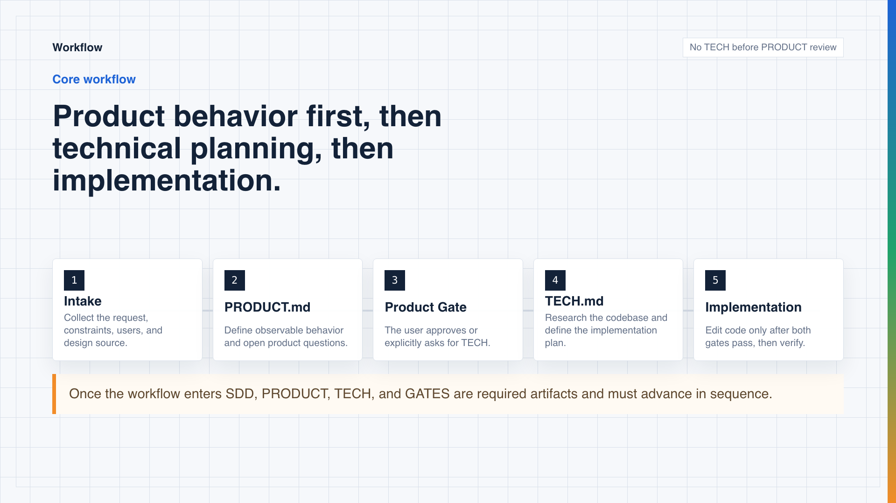

# Spec-Driven Development

<p align="center">
  <strong>Portable agent skills for behavior-first, gated, spec-driven feature delivery.</strong>
</p>

<p align="center">
  <a href="https://github.com/ai-x-builder/Spec-Driven-Development/blob/main/LICENSE"></a>
  
  
  
</p>




## Features

- Product-first specs: capture user-visible behavior as numbered `B*` invariants before technical planning.
- Review gates: persist PRODUCT and TECH approval state in a minimal `GATES.json`.
- Grounded tech plans: derive `TECH.md` from approved behavior and real codebase research.
- Spec-safe implementation: start coding only after both gates are approved.
- Figma support: turn design sources into visual contracts, implementation mappings, and verification checklists.
- Dependency-free linting: validate spec directories with a small Node.js script.

## Install

```bash
npx skills add ai-x-builder/Spec-Driven-Development -y -g
```

The global install places the skills under `~/.agents/skills/` for compatible coding agents to discover.

## Usage

Ask your agent to use the workflow in a target repository:

```text
Use spec-driven workflow to design and implement saved report filters.
```

For substantial work, the flow is:

1. Write `specs/<feature-id>/PRODUCT.md`.
2. Stop for PRODUCT approval.
3. Write `specs/<feature-id>/TECH.md`.
4. Stop for TECH approval.
5. Implement and verify against the approved specs.

Small bug fixes, narrow UI tweaks, and straightforward refactors can skip the workflow.

## Spec Layout

```text
specs/<feature-id>/
├── PRODUCT.md
├── TECH.md
└── GATES.json
```

`<feature-id>` can be a ticket id like `APP-1234`, issue id like `gh-4567` or `gl-7890`, or a short kebab-case name.

`GATES.json` has one supported shape:

```json
{
  "version": 1,
  "product": {
    "status": "pending"
  },
  "tech": {
    "status": "pending"
  }
}
```

Only `pending` and `approved` are valid statuses.

## Skills

- [`spec-driven-workflow`](./skills/spec-driven-workflow/SKILL.md): orchestrates the staged workflow.
- [`spec-write-product`](./skills/spec-write-product/SKILL.md): writes `PRODUCT.md` and stops at PRODUCT review.
- [`spec-write-tech`](./skills/spec-write-tech/SKILL.md): writes `TECH.md` after PRODUCT approval.
- [`spec-implement`](./skills/spec-implement/SKILL.md): implements after both gates are approved.
- [`spec-use-figma-design`](./skills/spec-use-figma-design/SKILL.md): extracts Figma-backed design context for specs and verification.

Example specs live in [`specs`](./specs).

## License

MIT