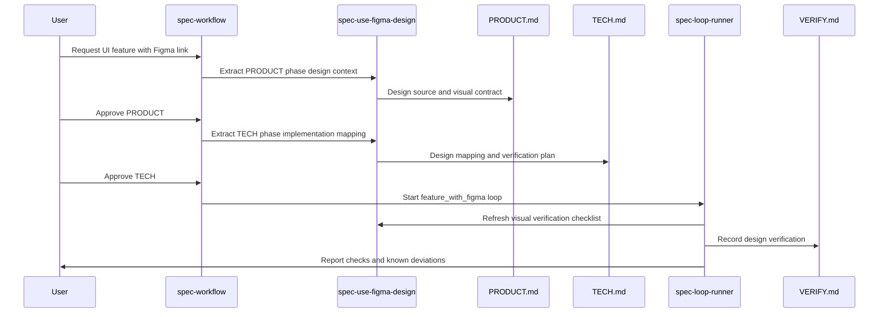

# Figma Workflow

FastSpec supports Figma-backed UI work by turning design context into reviewable spec material, implementation mapping, visual verification, and final reporting.

Figma support is handled by [`spec-use-figma-design`](../skills/spec-use-figma-design/SKILL.md). The skill is used alongside the main workflow; it does not replace `PRODUCT.md`, `TECH.md`, `GATES.json`, Loop Runner, or review gates.

## Why Figma Needs Spec Treatment

For UI work, design intent is often more precise than a written request. It may define layout hierarchy, interaction states, responsive behavior, visual emphasis, copy, icons, and edge-case states that are easy for an implementation agent to miss.

At the same time, a Figma link alone is not enough. Future agents may not have access to the file, may inspect a different frame, or may miss which visual details are acceptance-critical.

FastSpec records useful design context in source-controlled specs and verification artifacts so design intent remains reviewable and durable.

## Inputs

When UI, interaction, layout, or visual design matters, the workflow should ask whether a Figma source exists.

Useful inputs include:

- Figma URL
- specific frame, node, screen, or component references
- target pages, components, flows, states, and viewports
- existing design-system context
- screenshots, exports, recordings, or design notes when direct Figma access is unavailable
- current workflow phase: PRODUCT, TECH, or Loop Runner implementation

If direct Figma access is unavailable, fallback material can be used. The limitation must be recorded explicitly.

## PRODUCT Phase

During PRODUCT, Figma context is converted into product-facing acceptance material.

The output should be incorporated into `PRODUCT.md` as:

- `Design source` content with the Figma URL and specific frame, node, screen, or component references when available
- `Visual contract` content describing what the user sees or experiences
- numbered behavior invariants for visual or interaction expectations that affect acceptance
- blocking design questions when implementation would otherwise have to guess acceptance-critical behavior
- non-blocking design assumptions with impact
- access limitations when the design was not inspected directly

Implementation-specific details such as component names, CSS strategy, state shape, framework APIs, or asset pipeline choices belong in `TECH.md`.

## TECH Phase

During TECH, Figma context is converted into implementation mapping.

The output should be incorporated into `TECH.md` as a `Design implementation mapping` section when the feature is Figma-backed.

That mapping should cover:

- Figma screens, frames, components, states, and assets in scope
- existing code areas that correspond to those design surfaces
- existing components, design-system primitives, tokens, icons, assets, and styles to reuse
- new or extended UI primitives only when existing ones cannot satisfy the approved visual contract cleanly
- responsive and state implementation notes grounded in the current codebase
- design-system conflicts and tradeoffs
- intentional deviations from Figma, including reason and expected user-visible result
- whether a deviation requires PRODUCT re-approval
- visual verification plan for key screens, states, and viewports

## Loop Runner Implementation

During Loop Runner implementation, Figma context is used to verify that the approved visual contract and implementation mapping were followed.

The implementer should consult:

- approved `PRODUCT.md`
- approved `TECH.md`
- `GATES.json`
- Figma source or recorded fallback design material
- visual verification checklist from `spec-use-figma-design` when useful

For `feature_with_figma`, `VERIFY.md` should include `Design Verification` entries for acceptance-relevant visual expectations.

Verification can include:

- screenshots
- videos
- browser captures
- manual comparison summaries
- state-by-state walkthroughs
- viewport-specific checks

`REPORT.md` should name the Figma source or fallback material checked and call out known visual deviations.

## Fallback Behavior

Portable agents may not always have direct Figma API, MCP, browser, or plugin access.

When direct access is unavailable:

- ask for screenshots, exports, recordings, or design notes only when needed for the current phase
- proceed with recorded assumptions when missing details are non-blocking
- treat missing acceptance-critical visual details as blocking questions
- clearly state which details were inferred from fallback material
- do not imply that inaccessible Figma details were verified

## What Figma Support Does Not Do

The Figma workflow does not:

- approve gates automatically
- skip `PRODUCT.md` or `TECH.md`
- create a separate gate-state model
- require pixel-perfect matching by default
- treat every design measurement as acceptance-critical
- replace human review
- let implementation redefine product behavior without returning to PRODUCT Review Gate

Pixel precision can be required when PRODUCT says so, but the default is to capture and verify user-visible intent and acceptance-relevant constraints.

## Example Flow

