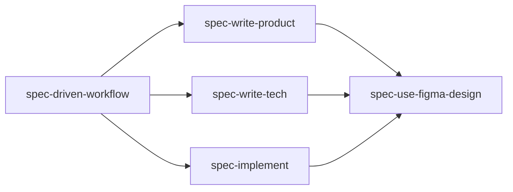

# Skills

This repository ships five portable agent skills. They are designed to work together, but each skill owns one clear part of the workflow.

The main entry point is `spec-driven-workflow`. The other skills are phase-specific helpers used by that workflow.

## Skill Map

## spec-driven-workflow

Path: [`skills/spec-driven-workflow/SKILL.md`](../skills/spec-driven-workflow/SKILL.md)

This is the orchestration skill. Use it when starting a significant feature, planning agent-driven implementation, or asking for gated product and technical specs checked into source control.

It decides whether the workflow is warranted, then coordinates:

- intake and scope evaluation
- spec directory naming
- creation of `PRODUCT.md`, `TECH.md`, and `GATES.json`
- PRODUCT Review Gate
- TECH Review Gate
- implementation readiness
- spec synchronization during implementation
- final verification against the specs

It is also responsible for enforcing the workflow sequence:

1. Write and review `PRODUCT.md`.
2. Approve the PRODUCT gate.
3. Write and review `TECH.md`.
4. Approve the TECH gate.
5. Implement and verify.

If the change is small enough that the spec overhead would not help, this skill should skip the workflow and explain why.

## spec-write-product

Path: [`skills/spec-write-product/SKILL.md`](../skills/spec-write-product/SKILL.md)

This skill writes the `PRODUCT.md` phase. It captures what the feature should do from the perspective of the user, caller, or consumer.

It owns:

- product summary and motivation
- user-visible or consumer-observable behavior
- stable numbered behavior invariants such as `B1`, `B2`, and `B3`
- optional BDD-style examples such as `B4-E1`
- edge cases, unavailable states, errors, limits, and non-goals
- design source and visual contract content for Figma-backed UI work
- classification of open product questions as blocking or non-blocking
- creation or reset of `GATES.json` after product changes
- PRODUCT Review Gate handoff

It must not write `TECH.md` in the same phase. Its output should be implementation-light so that the product behavior can be reviewed before the technical plan exists.

## spec-write-tech

Path: [`skills/spec-write-tech/SKILL.md`](../skills/spec-write-tech/SKILL.md)

This skill writes the `TECH.md` phase after `PRODUCT.md` has been approved.

It owns:

- codebase research before drafting
- context about how the current system works
- proposed implementation plan
- modules, files, interfaces, APIs, data flow, ownership boundaries, or components that will change
- product behavior mapping from `B*` and important `B*-E*` IDs to implementation and validation
- testing and validation plan
- risks, mitigations, and tradeoffs when relevant
- design implementation mapping for Figma-backed UI work
- TECH Review Gate handoff

It must not redefine product behavior. If technical research shows that the approved product behavior is infeasible or needs to change, the workflow returns to `PRODUCT.md`.

## spec-implement

Path: [`skills/spec-implement/SKILL.md`](../skills/spec-implement/SKILL.md)

This skill implements an approved feature. It is used only after both review gates have passed.

It owns:

- confirming `PRODUCT.md`, `TECH.md`, and `GATES.json` exist
- confirming `product.status` and `tech.status` are both `approved`
- reading the approved specs before editing code
- following a safe implementation loop
- keeping implementation scoped to the approved specs
- updating specs when implementation changes behavior or technical approach
- resetting gate state when specs change
- verifying the implementation against the specs
- reporting behavior evidence by `B*` and important `B*-E*` IDs

This skill treats `PRODUCT.md` as the source of truth for behavior and `TECH.md` as the source of truth for implementation plan, sequencing, risks, and validation.

## spec-use-figma-design

Path: [`skills/spec-use-figma-design/SKILL.md`](../skills/spec-use-figma-design/SKILL.md)

This skill extracts Figma-backed design context for UI work. It is phase-aware and can support PRODUCT, TECH, or IMPLEMENT.

During PRODUCT, it helps produce:

- design source references
- visual contract content
- visual and interaction behavior invariants
- blocking design questions
- non-blocking design assumptions and impact
- access limitations

During TECH, it helps produce:

- design implementation mapping
- component, token, asset, and style reuse notes
- responsive and state implementation notes
- design-system conflicts and tradeoffs
- visual verification plan
- intentional deviations from Figma

During IMPLEMENT, it helps produce or refresh:

- visual verification checklist
- screens, states, and viewports to capture or manually compare
- expected screenshots, videos, browser captures, or summaries
- known design access or capture limitations
- known visual deviations

It does not approve gates, skip specs, create alternate gate state, or require pixel-perfect matching by default.

## How The Skills Work Together

For a normal feature, an agent starts with `spec-driven-workflow`.

If specs are needed, `spec-driven-workflow` calls into `spec-write-product` to create the product behavior contract. If the work has UI or interaction design and a Figma source exists, `spec-use-figma-design` helps extract a visual contract.

After the user approves PRODUCT, `spec-driven-workflow` calls into `spec-write-tech`. If the feature is Figma-backed, `spec-use-figma-design` helps map the design to code areas, components, tokens, assets, and verification.

After the user approves TECH, `spec-driven-workflow` calls into `spec-implement`. If the feature is Figma-backed, `spec-use-figma-design` can refresh the visual verification checklist during implementation.

The skills remain separate so each phase has a clear job and a clear stopping point.
