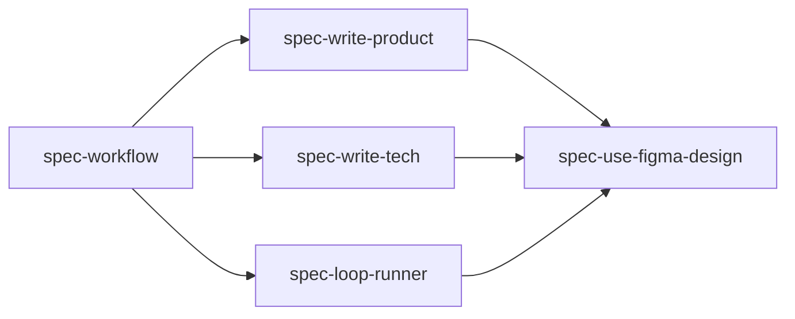

# Skills

FastSpec ships five portable agent skills. The `spec-*` directory names remain stable compatibility identifiers; user-facing workflow language should call the system FastSpec.

This page is an index. Detailed phase rules live in each skill's `SKILL.md`.

## Skill Map

## spec-workflow

Path: [`skills/spec-workflow/SKILL.md`](../skills/spec-workflow/SKILL.md)

Use this as the normal entry point. It decides whether FastSpec is worth using, creates the spec directory, coordinates PRODUCT and TECH gates, and starts Loop Runner after both gates pass.

Inputs:

- user request, ticket, issue, design source, or bug material
- target repository context
- any blocking or non-blocking constraints

Outputs:

- `PRODUCT.md`
- `TECH.md`
- `GATES.json`
- Loop Runner evidence when implementation starts

Stops at:

- PRODUCT Review Gate
- TECH Review Gate
- Loop Runner stop, block, or escalation

## spec-write-product

Path: [`skills/spec-write-product/SKILL.md`](../skills/spec-write-product/SKILL.md)

Use this for the PRODUCT phase only. It captures user-visible or consumer-observable behavior as stable numbered invariants such as `B1`, `B2`, and `B3`.

Inputs:

- feature summary and target users or consumers
- source material, constraints, edge cases, and design context when relevant

Outputs:

- `specs/<id>/PRODUCT.md`
- `specs/<id>/GATES.json` with both gates pending after product changes

Stops at:

- PRODUCT Review Gate

## spec-write-tech

Path: [`skills/spec-write-tech/SKILL.md`](../skills/spec-write-tech/SKILL.md)

Use this after PRODUCT is approved. It translates reviewed behavior into a codebase-grounded implementation plan without redefining product behavior.

Inputs:

- approved `PRODUCT.md`
- approved `product.status` in `GATES.json`
- relevant source code, tests, configs, and design implementation context

Outputs:

- `specs/<id>/TECH.md`
- `GATES.json` with `tech.status` pending after technical changes

Stops at:

- TECH Review Gate

## spec-loop-runner

Path: [`skills/spec-loop-runner/SKILL.md`](../skills/spec-loop-runner/SKILL.md)

Use this after PRODUCT and TECH are approved. It executes implementation through small Coordinator-led role iterations.

Inputs:

- approved `PRODUCT.md`
- approved `TECH.md`
- approved `GATES.json`
- relevant code, tests, configs, and source material

Outputs:

- `AGENT_ASSIGNMENTS.json`
- `LOOP_STATE.json`
- `TRACE.jsonl`
- `VERIFY.md`
- `REVIEW.md`
- `REPORT.md`

Supported profiles:

- `feature`
- `feature_with_figma`
- `bugfix`
- `refactor`

Stops at:

- successful completion
- blocked state
- PRODUCT Review Gate when behavior must change
- TECH Review Gate when the implementation plan must change

## spec-use-figma-design

Path: [`skills/spec-use-figma-design/SKILL.md`](../skills/spec-use-figma-design/SKILL.md)

Use this alongside PRODUCT, TECH, or Loop Runner when UI, interaction, layout, or visual design matters and a Figma source or fallback design material exists.

Inputs:

- Figma URL or fallback screenshots, exports, recordings, or notes
- current phase: PRODUCT, TECH, or Loop Runner
- target screens, states, flows, and viewports

Outputs:

- PRODUCT visual contract material
- TECH design implementation mapping
- Loop Runner design verification checklist and `VERIFY.md` entries

Does not:

- approve gates
- skip `PRODUCT.md` or `TECH.md`
- require pixel-perfect matching by default
- replace human review

## Coordination Rules

- Start with `spec-workflow` for normal feature work.
- Use `spec-write-product` and stop before TECH until PRODUCT is approved.
- Use `spec-write-tech` only after PRODUCT approval and stop before implementation until TECH is approved.
- Use `spec-loop-runner` only after both gates are approved.
- Use `spec-use-figma-design` only as phase support for UI or visual work.
- Skip FastSpec for small local fixes when specs would slow the work without improving review or safety.
