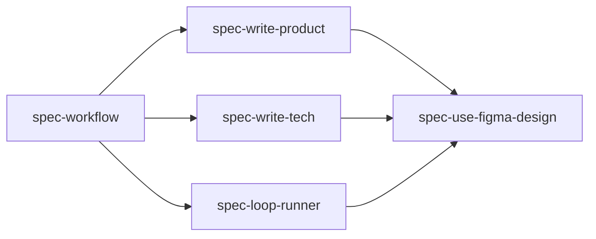

# Skills

This repository ships five portable agent skills. They are designed to work together, but each skill owns one clear part of the LoopSpec workflow.

The `spec-*` skill directory names are stable compatibility identifiers. User-facing workflow language should call the system LoopSpec.

The main entry point is `spec-workflow`. Phase-specific helpers write specs, extract design context, and execute approved implementation loops.

## Skill Map

## spec-workflow

Path: [`skills/spec-workflow/SKILL.md`](../skills/spec-workflow/SKILL.md)

This is the orchestration skill. Use it when starting substantial work, planning agent-driven implementation, or asking for specs and loop evidence checked into source control.

It coordinates:

- intake and scope evaluation
- spec directory naming
- creation of `PRODUCT.md`, `TECH.md`, and `GATES.json`
- PRODUCT Review Gate
- TECH Review Gate
- Loop Runner Implement
- verification matrix and final report
- spec synchronization during implementation

It enforces the sequence:

1. Write and review `PRODUCT.md`.
2. Approve the PRODUCT gate.
3. Write and review `TECH.md`.
4. Approve the TECH gate.
5. Run Loop Runner Implement.
6. Complete `VERIFY.md`.
7. Generate `REPORT.md`.

## spec-write-product

Path: [`skills/spec-write-product/SKILL.md`](../skills/spec-write-product/SKILL.md)

This skill writes the `PRODUCT.md` phase. It captures what the feature should do from the perspective of the user, caller, or consumer.

It owns:

- product summary and motivation
- user-visible or consumer-observable behavior
- stable numbered behavior invariants such as `B1`, `B2`, and `B3`
- optional BDD-style examples such as `B4-E1`
- edge cases, unavailable states, errors, limits, and non-goals
- design source and visual contract content for Figma-backed UI work
- open product question classification
- creation or reset of `GATES.json` after product changes
- PRODUCT Review Gate handoff

It must not write `TECH.md` in the same phase.

## spec-write-tech

Path: [`skills/spec-write-tech/SKILL.md`](../skills/spec-write-tech/SKILL.md)

This skill writes the `TECH.md` phase after `PRODUCT.md` has been approved.

It owns:

- codebase research before drafting
- current system context
- proposed implementation plan
- modules, files, interfaces, APIs, data flow, ownership boundaries, or components that will change
- product behavior mapping from `B*` and important `B*-E*` IDs to implementation and validation
- testing and validation plan
- risks, mitigations, and tradeoffs
- design implementation mapping for Figma-backed UI work
- TECH Review Gate handoff

It must not redefine product behavior.

## spec-loop-runner

Path: [`skills/spec-loop-runner/SKILL.md`](../skills/spec-loop-runner/SKILL.md)

This skill executes implementation after PRODUCT and TECH gates are approved.

It owns:

- approved-spec preflight checks
- context hydration before edits
- smallest-step delta planning
- atomic implementation
- per-iteration verification
- result classification
- `LOOP_STATE.json` updates
- `VERIFY.md` updates
- stop, block, and gate escalation decisions
- `REPORT.md` generation

Supported profiles:

- `feature`
- `feature_with_figma`
- `bugfix`
- `refactor`

## spec-use-figma-design

Path: [`skills/spec-use-figma-design/SKILL.md`](../skills/spec-use-figma-design/SKILL.md)

This skill extracts Figma-backed design context for UI work. It is phase-aware and can support PRODUCT, TECH, or Loop Runner implementation.

During PRODUCT, it helps produce:

- design source references
- visual contract content
- visual and interaction behavior invariants
- blocking design questions
- non-blocking design assumptions and impact
- access limitations

During TECH, it helps produce:

- design implementation mapping
- component, token, asset, and style reuse notes
- responsive and state implementation notes
- design-system conflicts and tradeoffs
- visual verification plan
- intentional deviations from Figma

During Loop Runner implementation, it helps produce or refresh:

- visual verification checklist
- screens, states, and viewports to capture or manually compare
- `VERIFY.md` design verification entries
- expected screenshots, videos, browser captures, or summaries
- known design access or capture limitations
- known visual deviations

It does not approve gates, skip specs, create alternate gate state, or require pixel-perfect matching by default.

## How The Skills Work Together

For a normal feature, an agent starts with `spec-workflow`.

If specs are needed, `spec-workflow` calls into `spec-write-product`. If the work has UI or interaction design and a Figma source exists, `spec-use-figma-design` helps extract a visual contract.

After the user approves PRODUCT, `spec-workflow` calls into `spec-write-tech`. If the feature is Figma-backed, `spec-use-figma-design` helps map the design to code areas, components, tokens, assets, and verification.

After the user approves TECH, `spec-workflow` calls into `spec-loop-runner`.

The skills remain separate so each phase has a clear job and a clear stopping point.
