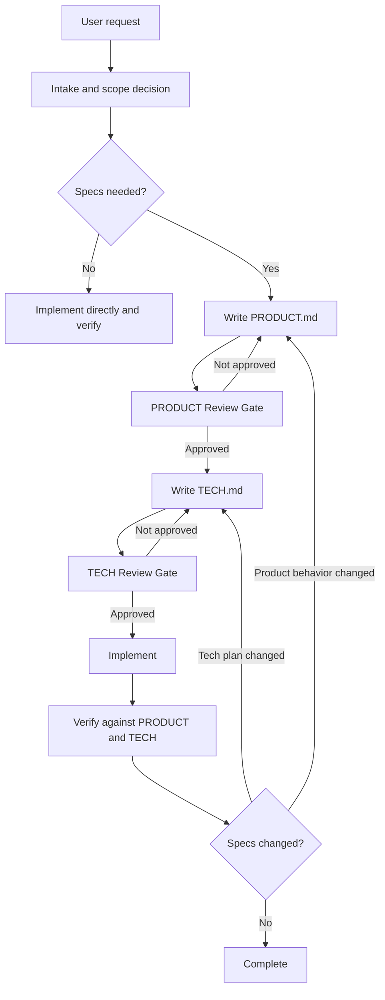

# Workflow

Spec-Driven Development is a staged workflow for substantial agent-driven work. It is designed to make product intent, technical planning, review state, and implementation evidence durable enough to survive across agent sessions, pull requests, and future maintenance.

The workflow is intentionally pragmatic. Small local bug fixes, narrow UI tweaks, and straightforward refactors can skip it. Once a change enters the workflow, the required artifacts are:

- `specs/<id>/PRODUCT.md`
- `specs/<id>/TECH.md`
- `specs/<id>/GATES.json`

## Why This Workflow Exists

Agent-driven implementation often fails for avoidable reasons:

- Product intent lives only in chat history and is easy to lose.
- Technical plans are written before product behavior is clear.
- Review approval is implied instead of recorded.
- Later implementation decisions drift away from the behavior that was originally accepted.
- A future agent cannot tell whether a spec is current, stale, or approved.

This workflow addresses those problems by separating the work into reviewable stages and checking the artifacts into source control.

## Design Principles

- Product behavior comes first. `PRODUCT.md` defines what the user, caller, or consumer observes.
- Technical planning follows approved product behavior. `TECH.md` translates the reviewed behavior into an implementation plan grounded in the current codebase.
- Implementation starts only after both gates pass. Code changes should be scoped to the approved specs.
- Specs stay alive. If implementation changes behavior or architecture, the specs and gate state must be updated.
- Review state is explicit. `GATES.json` records whether PRODUCT and TECH review gates have passed.

## High-Level Flow

## Phase 1: Intake

The workflow starts by collecting enough context to decide whether specs are useful:

- the user request
- linked tickets, issues, or feature IDs
- target users or consuming systems
- core scenarios and constraints
- design sources such as Figma links, screenshots, exports, or notes
- blocking and non-blocking questions

Blocking questions prevent the current phase from advancing. Non-blocking questions can proceed only when the current assumption and its impact are recorded.

## Phase 2: Decide Whether Specs Are Needed

Specs are strongly preferred when the change has meaningful ambiguity, risk, or review value, such as:

- product or architectural ambiguity
- expected implementation size around 1k+ LOC
- deep or cross-cutting stack changes
- behavior changes where regressions would be expensive
- agent-driven work that benefits from clearer durable inputs
- UI work where visual states, responsive behavior, layout, or interaction fidelity materially affect acceptance

Specs are often unnecessary for:

- small local bug fixes
- straightforward refactors
- narrow UI tweaks with little ambiguity

If specs would not improve execution or review, the agent should skip the workflow with a brief rationale and implement directly.

## Phase 3: PRODUCT.md

`PRODUCT.md` is the behavior contract. It answers what the feature does from the perspective of the user or consumer.

It should describe:

- the problem and desired outcome
- user-visible or consumer-observable behavior
- stable numbered behavior invariants such as `B1`, `B2`, and `B3`
- edge cases, limits, errors, unavailable states, and non-goals
- optional BDD-style examples such as `B4-E1` when concrete scenarios reduce ambiguity
- visual contracts for Figma-backed UI work
- unresolved product questions, classified as blocking or non-blocking

`PRODUCT.md` should avoid implementation details such as internal types, module boundaries, CSS strategy, state layout, or algorithms.

After `PRODUCT.md` is created or materially changed, both gate statuses are set to `pending`, and the workflow stops at the PRODUCT Review Gate.

## Phase 4: PRODUCT Review Gate

The PRODUCT gate passes only when:

- the user explicitly approves `PRODUCT.md` or asks to continue to TECH
- no blocking product questions remain
- non-blocking questions have recorded assumptions and impact
- the behavior is specific enough that `TECH.md` does not need to guess product intent
- Figma-backed visual expectations are captured when design matters
- `product.status` is updated to `approved` in `GATES.json`

If the gate does not pass, the agent revises `PRODUCT.md`, keeps the relevant status as `pending`, and returns to the PRODUCT Review Gate.

## Phase 5: TECH.md

`TECH.md` translates approved product behavior into an implementation plan. It should be written only after `product.status` is `approved`.

It should include:

- current codebase context and research evidence
- files, modules, APIs, data flow, ownership boundaries, or components that will change
- proposed implementation plan and key tradeoffs
- product behavior mapping from `B*` and important `B*-E*` IDs to implementation and validation
- testing and validation plan
- risks and mitigations when relevant
- design implementation mapping for Figma-backed UI work

`TECH.md` must not redefine product behavior. If technical research shows that product behavior needs to change, the workflow returns to `PRODUCT.md` and the PRODUCT gate must pass again.

## Phase 6: TECH Review Gate

The TECH gate passes only when:

- the user explicitly approves `TECH.md` or asks to continue to implementation
- no blocking technical questions remain
- non-blocking technical questions have recorded assumptions and impact
- the plan is consistent with the approved `PRODUCT.md`
- key risks, module boundaries, and validation steps are clear
- Figma-backed implementation mapping and visual verification plans are specific enough for implementation
- `tech.status` is updated to `approved` in `GATES.json`

If the gate does not pass, the agent revises `TECH.md`, keeps `tech.status` as `pending`, and returns to the TECH Review Gate.

## Phase 7: Implementation

Implementation can begin only when:

- `PRODUCT.md` exists
- `TECH.md` exists
- `GATES.json` exists
- `product.status` is `approved`
- `tech.status` is `approved`
- `TECH.md` is based on the latest reviewed `PRODUCT.md`

During implementation, the agent should:

- read the approved specs first
- inspect the current working tree when using Git
- search for existing files, tests, patterns, and usage points before creating new ones
- keep changes scoped to the approved specs
- update tests and verification artifacts as the feature lands
- keep specs and code in the same PR when practical

## Phase 8: Keep Specs Current

The specs should describe the feature that actually ships.

Update `PRODUCT.md` when user-facing behavior, UX, edge cases, behavior invariants, or acceptance-relevant visual expectations change. When `PRODUCT.md` changes, set both `product.status` and `tech.status` to `pending`.

Update `TECH.md` when the implementation approach, module boundaries, sequencing, risks, dependencies, rollout assumptions, or validation strategy changes. When `TECH.md` changes without product behavior changes, set `tech.status` to `pending`.

After any status reset, return to the relevant review gate before considering the work complete.

## Phase 9: Verification

Before completion, implementation must be verified against both current specs and the final gate state.

Good verification maps behavior IDs to evidence:

- unit tests
- integration or end-to-end tests
- manual workflow checks
- screenshots, videos, browser captures, or visual comparison summaries for UI-heavy work
- migration, compatibility, CLI output, API response, log, or telemetry checks when relevant

For Figma-backed UI work, final reporting should name the design source or fallback material checked and call out known visual deviations.
