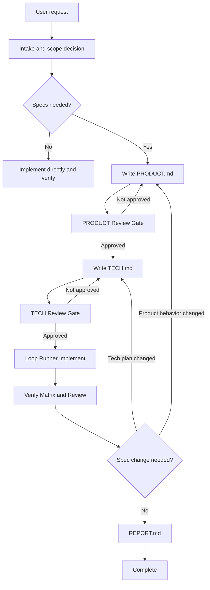

# Workflow

FastSpec is a staged workflow for substantial agent-driven work. It keeps product intent, technical planning, review state, implementation state, verification evidence, and final reporting durable across agent sessions, pull requests, and future maintenance.

The workflow is intentionally pragmatic. Small local bug fixes, narrow UI tweaks, and straightforward refactors can skip it. Once a change enters FastSpec, the core artifacts are:

- `specs/<id>/PRODUCT.md`
- `specs/<id>/TECH.md`
- `specs/<id>/GATES.json`

During implementation, Loop Runner adds:

- `specs/<id>/AGENT_ASSIGNMENTS.json`
- `specs/<id>/LOOP_STATE.json`
- `specs/<id>/TRACE.jsonl`
- `specs/<id>/VERIFY.md`
- `specs/<id>/REVIEW.md`
- `specs/<id>/REPORT.md`

## Speed As A Design Constraint

FastSpec is designed to feel fast in daily agent work. The workflow uses the fewest durable checkpoints that still prevent drift: PRODUCT approval, TECH approval, then small Loop Runner iterations with verification and review evidence.

Compared with heavier agent workflow systems such as superpowers, FastSpec keeps the core narrow. It avoids platform scheduling, dashboards, replay engines, broad approval metadata, and database-backed state in the default path. That tradeoff is deliberate: the fastest useful workflow is one an agent can read, update, review, and resume from plain repository files.

## Why This Workflow Exists

Agent-driven implementation often fails for avoidable reasons:

- Product intent lives only in chat history and is easy to lose.
- Technical plans are written before product behavior is clear.
- Review approval is implied instead of recorded.
- Implementation decisions drift away from approved behavior.
- Verification happens only at the end or is not mapped to the spec.
- A future agent cannot tell whether work is current, blocked, complete, or safe to resume.

FastSpec addresses those problems by separating reviewable planning from stateful implementation and checking the relevant artifacts into source control.

## Design Principles

- Fast by design. Prefer the shortest path that preserves product intent, technical intent, and verification evidence.
- Product behavior comes first. `PRODUCT.md` defines what the user, caller, or consumer observes.
- Technical planning follows approved product behavior. `TECH.md` translates reviewed behavior into an implementation plan grounded in the codebase.
- Implementation starts only after both gates pass.
- Implementation is a Coordinator-led role loop. Each step is planned, implemented, verified, reviewed, recorded, and evaluated.
- Specs stay alive. If implementation changes behavior or architecture, specs and gate state are updated.
- Review state is explicit. `GATES.json` records only PRODUCT and TECH review approval.
- Loop evidence is separate. `AGENT_ASSIGNMENTS.json`, `LOOP_STATE.json`, `TRACE.jsonl`, `VERIFY.md`, `REVIEW.md`, and `REPORT.md` record implementation evidence.
- Platform features stay out of the core. Add schedulers, dashboards, trace replay, or cost reporting only through a future approved spec.

## High-Level Flow



## Phase 1: Intake

The workflow starts by collecting enough context to decide whether specs are useful:

- the user request
- linked tickets, issues, or feature IDs
- target users or consuming systems
- core scenarios and constraints
- design sources such as Figma links, screenshots, exports, or notes
- bug reports, logs, crash reports, or reproduction steps when relevant
- blocking and non-blocking questions

Blocking questions prevent the current phase from advancing. Non-blocking questions can proceed only when the current assumption and impact are recorded.

## Phase 2: Decide Whether Specs Are Needed

Specs are strongly preferred when the change has meaningful ambiguity, risk, or review value, such as:

- product or architectural ambiguity
- expected implementation size around 1k+ LOC
- deep or cross-cutting stack changes
- behavior changes where regressions would be expensive
- agent-driven work that benefits from clearer durable inputs
- UI work where visual states, responsive behavior, layout, or interaction fidelity affect acceptance

Specs are often unnecessary for small local bug fixes, straightforward refactors, and narrow UI tweaks with little ambiguity.

## Phase 3: PRODUCT.md

`PRODUCT.md` is the behavior contract. It answers what the feature does from the perspective of the user or consumer.

It should describe:

- the problem and desired outcome
- user-visible or consumer-observable behavior
- stable numbered behavior invariants such as `B1`, `B2`, and `B3`
- optional BDD-style examples such as `B4-E1`
- edge cases, limits, errors, unavailable states, and non-goals
- visual contracts for Figma-backed UI work
- unresolved product questions, classified as blocking or non-blocking

After PRODUCT is created or materially changed, both gate statuses are set to `pending`, and the workflow stops at PRODUCT Review Gate.

## Phase 4: PRODUCT Review Gate

The PRODUCT gate passes only when:

- the user explicitly approves `PRODUCT.md` or asks to continue to TECH
- no blocking product questions remain
- non-blocking questions have recorded assumptions and impact
- behavior is specific enough that `TECH.md` does not need to guess product intent
- Figma-backed visual expectations are captured when design matters
- `product.status` is updated to `approved` in `GATES.json`

If the gate does not pass, revise PRODUCT and return to the gate.

## Phase 5: TECH.md

`TECH.md` translates approved product behavior into an implementation plan.

It should include:

- current codebase context and research evidence
- files, modules, APIs, data flow, ownership boundaries, or components that will change
- proposed implementation plan and key tradeoffs
- product behavior mapping from `B*` and important `B*-E*` IDs to implementation and validation
- testing and validation plan
- risks and mitigations
- design implementation mapping for Figma-backed UI work

TECH must not redefine product behavior. If technical research shows that product behavior needs to change, return to PRODUCT Review Gate.

## Phase 6: TECH Review Gate

The TECH gate passes only when:

- the user explicitly approves `TECH.md` or asks to continue to implementation
- no blocking technical questions remain
- non-blocking technical questions have recorded assumptions and impact
- the plan is consistent with approved PRODUCT
- risks, module boundaries, and validation steps are clear
- Figma-backed implementation mapping and visual verification plans are clear enough for implementation
- `tech.status` is updated to `approved` in `GATES.json`

If the gate does not pass, revise TECH and return to the gate.

## Phase 7: Loop Runner Implement

Implementation begins only when:

- `PRODUCT.md` exists
- `TECH.md` exists
- `GATES.json` exists
- `product.status` is `approved`
- `tech.status` is `approved`
- `TECH.md` is based on the latest reviewed `PRODUCT.md`

Loop Runner executes a Coordinator-led role loop:

```text
Coordinator -> Planner -> Implementer -> Verifier -> Reviewer -> Coordinator decision
```

Each iteration:

- reads only the context needed for the next step
- has Planner choose a small, independently verifiable change
- has Implementer change only that scope
- has Verifier run the smallest useful verification
- has Reviewer independently check scope, spec compliance, code quality, and risk
- classifies the result
- appends role activity and handoffs to `TRACE.jsonl`
- updates `LOOP_STATE.json`
- updates `VERIFY.md`
- updates `REVIEW.md`
- continues, stops, blocks, or escalates

Supported profiles are `feature`, `feature_with_figma`, `bugfix`, and `refactor`.

## Phase 8: Verify Matrix

`VERIFY.md` proves the implementation against the approved specs.

It maps:

- PRODUCT behavior IDs to evidence
- TECH requirements to evidence
- commands to results
- design requirements to evidence for Figma-backed work
- pending manual checks and residual risks

The matrix is updated throughout implementation and must have no blocking pending item before successful completion.

## Phase 9: Report

`REPORT.md` is the final delivery report. It summarizes:

- what shipped
- current spec and gate state
- loop profile, iteration count, and final decision
- validation commands and artifacts
- behavior evidence
- known limitations, risks, and follow-ups

`REVIEW.md` must have a non-blocking reviewer decision before the report can claim successful completion. Reviewer decisions do not approve PRODUCT or TECH gates.

## Keep Specs Current

The specs should describe the feature that actually ships.

Update `PRODUCT.md` when user-facing behavior, UX, edge cases, behavior invariants, or acceptance-relevant visual expectations change. When PRODUCT changes, set both gate statuses to `pending`.

Update `TECH.md` when implementation approach, module boundaries, sequencing, risks, dependencies, rollout assumptions, or validation strategy change. When TECH changes without product behavior changes, set `tech.status` to `pending`.

After any status reset, return to the relevant review gate before considering the work complete.
